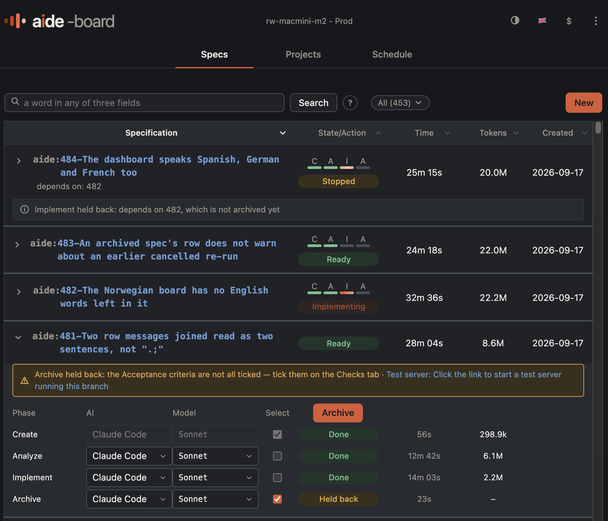

# <picture><source media="(prefers-color-scheme: dark)" srcset="docs/assets/aide-wordmark-dark.svg"></picture>

Spec-driven development for AI assistants: every change starts as a spec, and a dashboard runs it through analysis,
implementation and archiving.

## Table of contents

- [What it is](#what-it-is)
- [What a spec looks like](#what-a-spec-looks-like)
- [Where Aide sits in spec-driven development](#where-aide-sits-in-spec-driven-development)
- [The aide-* skills](#the-aide--skills)
- [Install & Configuration](#install--configuration)
    - [Per-project configuration](#per-project-configuration)
        - [AIDE_SPECS_PATH](#aide_specs_path-optional-per-project)
- [AI-assisted workflow](#ai-assisted-workflow)
- [The Aide dashboard](#the-aide-dashboard)
- [Resources](#resources)

---

## What it is

An AI assistant is powerful but unpredictable when the requirements for a change live only in a chat history: the
reasoning behind a decision disappears with the conversation, the next session starts from zero, and nobody else can
review what was actually agreed before the code was written.

Aide's answer is spec-driven development (SDD): before any AI assistant writes code, it writes a specification — four
plain-Markdown files (description, analysis, solution, status) that a user and any AI tool can read, review and
continue identically, committed to git alongside the code it describes.

**Everything can be done with the skills.** Each step — create, analyze, implement and archive — is an `aide-*`
skill you run by hand, one spec at a time, inside Claude Code, Codex, OpenCode or GitHub Copilot.
See [The aide-\* skills](#the-aide--skills).

**The dashboard is the easier way to use them.** It works one level up: it lists every spec across every project Aide
knows about and runs the same skills for you — queued and unattended, with a user stepping in only where a judgement
is needed, such as ticking the acceptance criteria before archive. See [The Aide dashboard](#the-aide-dashboard).

Either way, the spec is what lets any AI assistant:

- Understand a spec and analyze the codebase automatically
- Suggest concrete solutions with file references and line numbers,
  reviewable as a diff before a line of code changes
- Implement changes using Test-Driven Development (TDD)
- Follow established plans for technical debt and modernization that
  span many sessions, not one prompt

**Key benefit:** Not locked to a single AI vendor - teams can pick the
best tool for each task, and the spec is what carries the work between
them.

---

## What a spec looks like

A spec is a folder of four files:

- `1-description.md` — what is wrong and what done means. The user writes it, or has `/aide-create` draft it from a
  title and a few sentences
- `2-analysis.md` — what analyze found in the codebase
- `3-solution.md` — the plan analyze writes for implement to follow
- `4-status.md` — where every step records its progress

This is an archived spec from Aide's own work, shortened where it says `[...]`.

From `1-description.md`:

```markdown
# A spec's row offers a test server only where one can run - Description

## Problem

When a spec's archive is held back on unticked acceptance criteria, its row on the specs list adds "Test server:
click the link to start a test server running this branch". [...] The spec page already checks that before it shows
the start button; the row does not, so a spec in [another project] gets a link that leads to the "this project's own
checkout does not carry the dashboard's source" page.

## Acceptance criteria

- **AC-1:** For a spec held back on unticked acceptance criteria, belonging to a project whose checkout carries the
  dashboard's source, the row SHALL show the held-back mark together with a link to start a test server.
- **AC-2:** [...] belonging to a project whose checkout does NOT carry the dashboard's source, the row SHALL show the
  held-back mark alone, with no test-server link.
- **AC-3:** The row's decision of whether the project can run a test server SHALL use the same per-project check the
  spec page already uses, not a separate or duplicated check.
```

`4-status.md` records what ran, and ends with the criteria as rows that only a user ticks. Archive waits until
every row is ticked:

```markdown
- **Result:** completed
- **Workflow steps completed:** create, analyze, implement, archive

## Acceptance criteria

| Task                                                              | Status | Notes |
|-------------------------------------------------------------------|--------|-------|
| AC-1: For a spec held back on unticked acceptance criteria, [...] | ✅      |       |
| AC-2: For a spec held back on unticked acceptance criteria, [...] | ✅      |       |
| AC-3: The row's decision of whether the project can run [...]     | ✅      |       |
```

---

## Where Aide sits in spec-driven development

Spec-driven development means writing a spec before an AI assistant writes code, and treating that spec as the
source of truth for both the user and the assistant. Birgitta Böckeler's
[Understanding Spec-Driven-Development](https://martinfowler.com/articles/exploring-gen-ai/sdd-3-tools.html) names
three levels of it:

| Level          | The spec …                                                                      |
|----------------|---------------------------------------------------------------------------------|
| Spec-first     | is written first and guides the work, then is discarded once the feature exists |
| Spec-anchored  | is kept after the work and edited as the feature evolves                        |
| Spec-as-source | is the only thing a user edits; the code is generated from it                   |

Aide is spec-anchored. A spec stays open while the change it describes is still being shaped: when a user
declines to accept the result, they edit the spec's acceptance criteria and the same spec runs another round of
analysis or implementation — a round that may only start once every open criterion is new or changed since the
last one. When the user is satisfied, they tick the criteria and archive it. A spec is never discarded: it moves to
`archive/` with its history, and what it taught is written back into the project's living documentation, which is
where the current state of the system is described. It is not spec-as-source: users and assistants still read and
edit the code.

---

## The aide-\* skills

The four spec-workflow skills, in the order a spec moves through them:

| Skill             | Does                                                                                                                                           |
|-------------------|------------------------------------------------------------------------------------------------------------------------------------------------|
| `/aide-create`    | Creates a spec from a title and a description: the 4-file structure (description, analysis, solution, status)                                  |
| `/aide-analyze`   | Analyzes the codebase, detects LOW/MEDIUM/HIGH complexity, maps affected files with file:line references, and writes the TDD plan              |
| `/aide-implement` | Implements the plan with TDD (RED → GREEN → REFACTOR), reading the existing analysis and solution                                              |
| `/aide-archive`   | Archives a finished spec, resolves any merge conflict with the default branch, and feeds durable knowledge back into the project's living docs |

Supporting skills, used around that workflow rather than as a step in it:

| Skill            | Does                                                                                                                    |
|------------------|-------------------------------------------------------------------------------------------------------------------------|
| `/aide-explore`  | A no-stakes thinking partner before `/aide-create` — weighs approaches and sharpens the scope, creates nothing          |
| `/aide-manifest` | Drafts or refreshes a project's `.aide/project.yaml` manifest (stack, dependencies, deployment, docs)                   |
| `/aide-close`    | Closes a spec whose idea did not hold: records the reason, moves it to `archive/`, and deletes its code branch unmerged |
| `/aide-reopen`   | Takes an archived spec back into the active list for another round, keeping the description and archive trail           |
| `/aide-reset`    | Resets an invalid active spec work round, keeping its README, description, commits and job history                      |
| `/aide-to-pdf`   | Generates a PDF from a spec's documentation                                                                             |

---

## Install & Configuration

Clone the repo, then run the installer for your AI tool:

| AI tool        | Install                                  | Documentation                                        |
|----------------|------------------------------------------|------------------------------------------------------|
| Claude Code    | `implementations/claude-code/install.sh` | [INSTALL.md](implementations/claude-code/INSTALL.md) |
| GitHub Copilot | `implementations/copilot/install.sh`     | [INSTALL.md](implementations/copilot/INSTALL.md)     |
| Codex          | `implementations/codex/install.sh`       | [README.md](implementations/codex/README.md)         |
| OpenCode       | `implementations/opencode/install.sh`    | [README.md](implementations/opencode/README.md)      |

`./install-all.sh` runs all four at once. Each installer is self-contained: instructions, commands/prompts, scripts and
documentation, installed globally so any project can use them.

The dashboard is installed after this, on the machine that will run it: it starts every step through Aide's own
scripts and skills, so they have to be there first. See
[Installation in the dashboard's README](dashboard/README.md#installation).

> **Windows users:** The scripts require WSL or Git Bash.
> See [WSL installation](https://learn.microsoft.com/en-us/windows/wsl/install).

### Per-project configuration

#### AIDE_SPECS_PATH (optional, per project)

Store specs outside a project — set the key
in `.aide/config` in that project's root:

```text
AIDE_SPECS_PATH=/Users/you/develop/my-specs-repo
```

**Default:** specs are written to `specs/` in the project root. The path
is per-project configuration, not an environment variable — two projects
can point at two different spec repos. Keep the personal config out of git
with a global personal gitignore (`core.excludesFile`) containing
`.aide/config` — the manifest `.aide/project.yaml` is team knowledge
and belongs in git.

---

## AI-assisted workflow

All AI tools follow the same basic workflow:

```text
   (EXPLORE — optional: think the idea through first, no files yet)

1. CREATE the spec
   ↓
   A title and a description → 4 files (description/analysis/solution/status)

2. ANALYZE the codebase
   ↓
   Reads the code → Identifies affected files → Writes the plan, and reviews it

3. IMPLEMENT the solution
   ↓
   RED: Write tests → GREEN: Implement → REFACTOR — the phase ends on a green test run

4. ARCHIVE
   ↓
   Lands the code on the default branch → Feeds what was learned back into the docs
```

**Example (Claude Code):**

```bash
/aide-create "Move the forms off Redux Form" The forms still use Redux Form, which is unmaintained. Move them to React Hook Form, one form at a time, keeping the validation rules.
# The spec gets a number, say 55:
/aide-analyze 55      # Analyze the codebase
/aide-implement 55    # Implement with TDD
/aide-archive 55      # Archive, feed knowledge back into the docs
```

**See:** [core/skills/workflows/SKILL.md](core/skills/workflows/SKILL.md) for details.

---

## The Aide dashboard

All Aide skills can be run by hand, one spec at a time, in any of the AI CLI assistants Aide supports. The dashboard
runs them for you, and adds what running them by hand does not give you:

- **Every spec in one list** — across every project Aide knows about, with search and a state filter
- **Unattended runs** — a spec is queued through `create` → `analyze` → `implement` → `archive`, potentially in
  parallel
- **The AI and model per step** — chosen for each phase of each spec
- **Live progress** — the running step, its time and its tokens, on the spec's row
- **Dependencies** — a spec that overlaps with another spec can be configured to wait to be implemented until the
  first has completed
- **Acceptance criteria** (optional) can be specified. If desired, the dashboard can stop before archiving and prompt
  the user to verify them before continuing
- **Modify and rerun** — if acceptance criteria are specified and not fulfilled by the implementation, the spec
  description and criteria can be modified to be more precise, and the analyze and implement phases rerun. Criteria
  that are already ticked are not touched by the rerun
  (see [Another round on the same spec](dashboard/docs/spec-lifecycle.md#another-round-on-the-same-spec))
- **Code that lands itself** — merged into the main branch once the tests pass, or left as a pull request for review
  (see [How a project's code lands](dashboard/docs/projects.md#how-a-projects-code-lands))
- **The whole history** — clicking a spec opens its description, analysis, plan, status and every job that has run
  against it

<p align="center"></p>

It finds projects by scanning for `.aide/project.yaml` manifests and reads each spec's phase from its `4-status.md`,
so nothing has to be registered by hand. It runs as a small server on a machine of your choosing — a laptop, or a
machine that stays on so runs continue after you close the lid.

It lives in `dashboard/` and has its own documentation: **[dashboard/README.md](dashboard/README.md)**.

---

## Resources

- [Understanding Spec-Driven-Development](https://martinfowler.com/articles/exploring-gen-ai/sdd-3-tools.html) - Birgitta Böckeler on the levels of spec-driven development and the tools behind them
- [Spec-driven development with AI: Get started with a new open source toolkit](https://github.blog/ai-and-ml/generative-ai/spec-driven-development-with-ai-get-started-with-a-new-open-source-toolkit/)
- [Anioko/spec-driven-development](https://github.com/Anioko/spec-driven-development)
- [GitHub Spec Kit](https://github.com/github/spec-kit)
- [OpenSpec](https://github.com/Fission-AI/OpenSpec)
- [Kiro](https://kiro.dev)
- [Tessl](https://tessl.io/)
