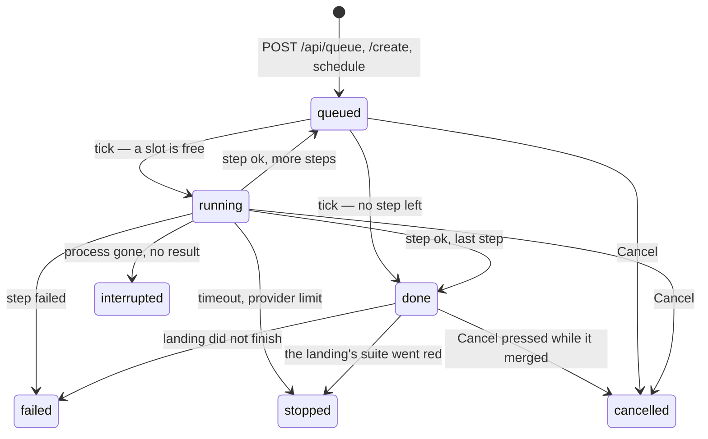

# A job's states

The one place the queue's state machine is written down: what a job's `state` can be, which piece of code moves it
and when, and the fields beside it that behave like a state without being one.

The code is `JOB_STATES` and `TRANSITIONS` in `src/queue/steps.ts`. Nothing writes `state` directly — every caller
goes through the one `QueueStore.transition()` in `src/queue/store/index.ts`: the runner
(`src/queue/runner/index.ts` and `src/queue/runner/unticked-archive.ts`), the cancel route in
`src/serve/routes/job-actions.ts`, the test board's own bulk cancel in `src/serve/routes/self-run.ts`, and the
landing in `src/serve/land-branch/merge.ts`.

Three pages sit beside this one:

- [The specs list and the spec page](the-specs-list.md) — how a state reads on the page
- [A spec's lifecycle](spec-lifecycle.md) — the level above: which of the four phases a SPEC has reached
- [Error sentences](error-sentences.md) — the one rule a job's own `error` sentence follows

## Table of contents

- [The seven states](#the-seven-states)
- [The transitions](#the-transitions)
- [Beside the state](#beside-the-state)
- [What the page makes of it](#what-the-page-makes-of-it)

---

## The seven states

A job is an ordered list of steps with a `stepIndex`; its `state` says where the job as a whole is.

| State         | Meaning                                                                                                                                                                                                     |
|---------------|-------------------------------------------------------------------------------------------------------------------------------------------------------------------------------------------------------------|
| `queued`      | Waiting for the runner to start its next step. Also where a job sits between two steps.                                                                                                                     |
| `running`     | One step has a live process. `pid`, `pgid`, `resultFile`, `sessionId` and `streamFile` are set.                                                                                                             |
| `done`        | No step is left to run. Written the instant the last step's process succeeds, so a landing that follows may still fail — and an `archive` held back on unticked criteria reaches it without running at all. |
| `stopped`     | A step reached its own time limit, a provider limit ended it, or a landing's test run went red. `stopReason` says which.                                                                                    |
| `failed`      | A step reported failure, or a landing after a successful step did not finish.                                                                                                                               |
| `cancelled`   | A user pressed Cancel.                                                                                                                                                                                      |
| `interrupted` | The step's process died without leaving a result.                                                                                                                                                           |

Only `queued` and `running` own their work (`UNFINISHED` in `src/queue/steps.ts`), and the duplicate guard is
built on that set alone. A second guard sits beside it: `QueueStore.landingJob()` refuses a NEW job of any step for
a spec whose own job reads `done` with a landing still in flight, since that spec's working tree is half merged.
Once the landing settles, the same step may be queued again — as a new job; a finished job is never resumed.

## The transitions

**Into the queue.** Five callers insert a job as `queued`: `POST /api/queue`, `POST /api/queue/create`, the
schedule poll, the schedule page's own Run now, and the Close control on a spec's page.

**The runner's tick, every two seconds** (`Runner.tick()`), walks the queue in `queuePriorityOrder()`'s order — every
queued `create`, `archive` or `close` step — the ones that do no model work — before any queued `analyze` or
`implement`, oldest first within each group
(`src/queue/steps.ts`) — and, for each `queued` job:

- Skips a job that has `landing` set: that job's next step waits for its own merge. Every other job runs as
  usual — see [Beside the state](#beside-the-state).
- Skips a job whose spec already has a running job: two steps for one spec are ordered by nature.
- Leaves an `archive` job `queued` with a reason on it — "held back: another archive is running in this project — it
  starts when that one has merged" — while another `archive` in the same project is running or landing. Both branch
  from the code root's main and both land into it, so the second waits for the first to have merged. This is the
  cheapest of the three holds and the one asked first; the two below need the spec's own files or the network.
- Leaves a job `queued` with a reason on it — "held back: not analyzed yet — run /aide-analyze first" — when its own
  spec's `analyze` step has not completed, and tries again next tick. The state does not move.
- Leaves a job `queued` with a reason on it — "held back: depends on …" — when a dependency it names has not
  archived, and tries again next tick. The state does not move.
- Ends an `archive` whose spec still has an unticked acceptance row `done`, before anything else and without
  taking a slot, with the result `core/scripts/aide-archive-spec`'s own pre-check would have written
  (`terminalReason: acceptance-criteria-unticked`, no process, no cost). The row's badge reads **Ready** — unticked
  criteria are the spec's own next step — and the notice line under it carries the reason. A user presses Archive
  once the rows are ticked; a tick never starts it. It is judged only on the
  BRANCH copy read since the last tick (`archiveWithOpenAcceptance`, `schedules/blocked.ts`); an unread or stale
  answer starts the step, and the script's own pre-check decides.
  That reason is worked out afresh on every render, never remembered from a refusal, and it
  asks the BRANCH's copy of `4-status.md` before the disk's (`spec-lookup.ts`): a tick on a spec whose
  `aide/<folder>` is open lands there, and the disk copy stays unticked until archive lands. It says nothing while
  a round is under way (`row-marks.ts`) — a reader whose own run is going has nothing to go and tick.
- Moves a job with no step left to `done`.
- Otherwise spawns the step and writes `running`, with the process and file fields.

**When a step ends** (`Runner.complete()`, reached from `poll()` when the result file appears):

- `timeout` or `provider-limit` as the run's terminal reason gives `stopped`, with that `stopReason`. A
  `provider-limit` step also carries `providerLimit` — the tool's own record of which window ran out, when it resets,
  the other windows' figures, and the plan or refused credit where the tool names them. The runner reads it from
  claude's `rate_limit_event` and from the session file Codex keeps for the thread (a Codex turn is a
  `provider-limit` only when that file shows a full window); opencode has no reader. The row and the Logs tab say it
  as one sentence in place of the runner's own summary. A stopped step lands what it pushed outside the code root — a
  `timeout` or `provider-limit` step, with something pushed, and no code root among it; a stopped `implement` whose
  code branch was pushed lands nothing, and that code waits for `archive`. A landing that does run leaves the job's
  `error` in place: it is the reason the step stopped, not a fault the landing resolved.
- Any other failure gives `failed`, with `error` and, when the runner found a merge conflict at step start,
  `errorReason: "conflict"`.
- Success on the last step gives `done`. Success with steps left gives `queued` again, with `stepIndex` advanced.
  There is no stop between steps: every step lands its own work.

**Interrupted** is written in two places, both for a `running` job whose process is gone and whose result file is
empty: `poll()` while the server runs ("the run vanished without leaving a result"), and `reconcile()` on boot ("the
server restarted while this step was running"). A job whose process is gone but whose result IS on disk is completed
normally from that file — nothing about a restart is guessed at.

**Cancelled** comes from `POST /api/queue/<id>/cancel`, and from the test board's own control, which cancels every
queued and running job of a project at once. Both write `cancelled` first and then send `SIGTERM` to the job's
process group, where there is one. A job that has already finished is refused with 409 and keeps its state: `done`,
`failed`, `stopped` and the rest are history, and Cancel does not rewrite history.

**Done to failed** is the one transition made after the fact. The step succeeded, so `complete()` has already written
`done`, and the landing runs afterwards. When that landing is refused for a conflict, or `archive`'s landing finds the
spec's branch still on origin, the `landing-failed` transition moves the job to `failed` with `errorReason` — and only
from `done`: the runner may have queued the job's next step in between, and a landing must not overwrite a job that
has moved on; the table simply has no entry for that case, so the attempt is refused. `error`/`errorReason`/
`stopReason` say what a row is waiting for RIGHT NOW, so none of them are written onto a job that has moved on — only
`landingError`, the permanent record of that attempt, survives there, exactly as it already does on the `done`/
`stopped` path below, and `landingErrorDetail` carries the raw words behind it — `errorDetail` belongs to what the row
waits for now, and a job that has moved on has overwritten it. The record names the step it belongs to, and that
step's OWN landing clears it when it succeeds later; a LATER step's success leaves it alone. See
[Branches and landing](landing.md).

**Done to stopped** is the same transition for the one landing failure that is nobody's fault. The landing runs the
project's own suite on the merged result, and a red suite pushes nothing: `landing-held` moves the job to `stopped`
with `stopReason: "tests-red"`, so the State cell reads `stopped — tests red` and the row's message is amber. The
work is not green yet — run implement again — which is a different thing from a broken agent, and the row says so.

Cancel works while a finished step's work is being merged and tested, though the job already reads `done`: the
scripts the merge runs for it are stopped, nothing is pushed, and `landing-cancelled` moves the job to `cancelled`.

## Beside the state

Three fields say something the state alone does not, and each is read by the page as if it were one. `error`
rides with the last of them, and the permanent records of a landing attempt — `landingError` and
`landingErrorDetail` — are in [The transitions](#the-transitions) above, where they are written.

- **`landing`** is set on a job while its finished step's branch is being merged, and cleared once the whole landing
  promise settles. It holds back that job alone — its own next step waits for its merge — and nothing else on the
  board: the landing merges in a worktree of its own and touches the shared checkout for one fast-forward at the
  end. It is never restored from the persisted mirror: a flag that survived a restart would hold that job shut with
  nothing left to clear it. **An `onLanded` callback runs before its own job's flag is
  cleared.** `Runner.complete()` in `src/queue/runner/index.ts` is synchronous: it starts the landing work (`onStepDone`,
  e.g. `landArchivedSpec` for `archive`), writes `landing: true` onto the job's own store row, and only clears that
  flag in a `.then()` once the WHOLE landing promise settles — including whatever `onLanded` itself does. So a callback
  that reads `queue.list()` sees its own triggering job still marked `landing: true` even though the landing calling
  it has already succeeded, and must treat that one row as settled by hand; every other row's flag is as trustworthy
  as ever. The step's own phase line follows the same flag: its badge reads "Running", not "done", and its
  own duration keeps counting until the landing settles — the row's state and the phase line never disagree about
  whether the step is still going. The flag belongs to the step being merged: a chained job has already moved
  `stepIndex` on to its next step when the landing starts, so that next step reads "Queued", never "Running".

  The row also reads the spec's files and git history, which are cached and catch up after the queue does. Each
  answer carries when it was read (`SpecTarget.sourcesCheckedAt`, the older of the history's and the branch copy's
  read), and a phase whose latest run ended after that reads as its run's own word, with no sentence about the files
  disagreeing — they have not seen the run yet. A step with no landing of its own (`implement`, a failed step) has
  those answers read again as soon as its result is written (`stepDoneHandler`, `src/serve/runner-setup.ts`); a step
  with a landing has them read again by the landing.
- **`stopReason`** is `timeout`, `provider-limit` or `tests-red`, set with `stopped` and nowhere else.
  `stopped` is deliberately not `failed`: under a tight timeout a time-stop is a common, healthy outcome, and a red
  suite on a landing is work that is not green yet rather than a broken agent.
- **`errorReason`** is `conflict`, `held-back`, `tests-red` or `unlanded`, set when something stands in the way of
  the job: the class of it, for a reader who needs to act without matching on the sentence. `conflict` and `unlanded` are
  resolved by running `archive` again; `tests-red` by making the suite green and running the step again; and
  `held-back` clears itself on a later tick, with nothing for anyone to press. A landing held for a red suite sets
  it beside `stopReason: tests-red` — the same fact, once as the state's reason and once as its class. It is declared in `src/queue/types.ts` and again
  in `src/render/ui/job-state/types.ts`,
  which do not import each other; `test/queue/requests/parsing-schedule-and-errors.test.ts` reads both as text and asserts they agree.
  `error` beside it is what a reader is told: always written on `failed`, on `interrupted`, on a `queued` job that
  is held back, and on a landing held for a red suite. A `timeout` or `provider-limit` stop passes the run's own
  error through, so a result file that recorded none leaves it unset. It is a `Sentence`, or several: a message key and its values, translated where it is drawn, never
  a finished string the queue made up.

## What the page makes of it

The row's badge is short by design, and what it does not say is on the notice line under it. A running job reads
**Running**; a queued one **Queued 3/11** — its place among every job waiting its turn, off the same order the
runner picks — or "<phase> queued" when it has no position, or **Held back**. Once nothing is running the badge is
one word: **Ready**, **Done** or **Stopped**, and `failed`, `cancelled` and `interrupted` are the bare word too.

The longer forms — "stopped — 45 min", "stopped — provider limit", "stopped — tests red" — exist, but on the job's
own detail page, on the phase lines and in the schedule report, not on the row. `cancelled` is drawn amber like
`stopped`, since it is a step somebody stopped by hand rather than a failure; `interrupted` is grouped with
`failed`. The words themselves live in `src/render/ui/job-state/` and are described on
[The specs list and the spec page](the-specs-list.md#the-state-column).
