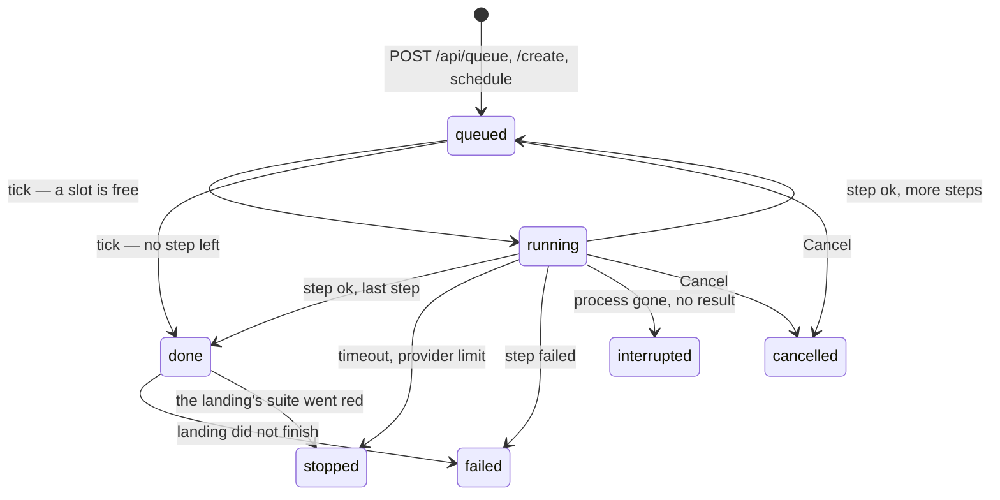

# A job's states

The one place the queue's state machine is written down: what a job's `state` can be, which piece of code moves it
and when, and the three fields beside it that behave like a state without being one. The code is `JOB_STATES` and
`TRANSITIONS` in `src/queue/steps.ts`, consulted through the one `QueueStore.transition()` in `src/queue/store/index.ts`
that every caller — `src/queue/runner/index.ts`, the cancel route in `src/serve/routes/job-actions.ts`, and the
landing in `src/serve/land-branch/merge.ts` — asks instead of writing `state` itself. How a
state reads on the page is on [The specs list and the spec page](the-specs-list.md); the level above — which of the four
phases a SPEC has reached, and what moves it — is on [A spec's lifecycle](spec-lifecycle.md). What a job's own
`error` sentence has to say is the one rule on [Error sentences](error-sentences.md).

## Table of contents

- [The seven states](#the-seven-states)
- [The transitions](#the-transitions)
- [Beside the state](#beside-the-state)
- [What the page makes of it](#what-the-page-makes-of-it)

---

## The seven states

A job is an ordered list of steps with a `stepIndex`; its `state` says where the job as a whole is.

| State         | Meaning                                                                                         |
|---------------|-------------------------------------------------------------------------------------------------|
| `queued`      | Waiting for the runner to start its next step. Also where a job sits between two steps.         |
| `running`     | One step has a live process. `pid`, `pgid`, `resultFile`, `sessionId` and `streamFile` are set. |
| `done`        | Every step succeeded and, for a step that lands, the landing succeeded too.                     |
| `stopped`     | The wall clock or a provider limit ended a step. `stopReason` says which.                       |
| `failed`      | A step reported failure, or a landing after a successful step did not finish.                   |
| `cancelled`   | A person pressed Cancel.                                                                        |
| `interrupted` | The step's process died without leaving a result.                                               |

Only `queued` and `running` own their work (`UNFINISHED` in `src/queue/steps.ts`). Every other state has released
it: the same step may be queued again for the same spec, and the duplicate guard no longer refuses it.

## The transitions

**Into the queue.** `POST /api/queue`, `POST /api/queue/create` and the schedule poll all insert a job as `queued`.

**The runner's tick, every two seconds** (`Runner.tick()`), walks the queue in `queuePriorityOrder()`'s order — every
queued `create` or `archive` step before any queued `analyze` or `implement`, oldest first within each group
(`src/queue/steps.ts`) — and, for each `queued` job:

- Starts nothing at all while any job has `landing` set — see [Beside the state](#beside-the-state).
- Skips a job whose spec already has a running job: two steps for one spec are ordered by nature.
- Leaves an `archive` job `queued` with a reason on it — "held back: another archive is running in this project — it
  starts when that one has merged" — while another `archive` in the same project is running or landing. Both branch
  from the code root's main and both land into it, so the second waits for the first to have merged. This is the
  cheapest question of the four and the one asked first; the three below need the spec's own files or the network.
- Leaves a job `queued` with a reason on it — "held back: not analyzed yet — run /aide-analyze first" — when its own
  spec's `analyze` step has not completed, and tries again next tick. The state does not move.
- Leaves a job `queued` with a reason on it — "held back: depends on …" — when a dependency it names has not
  archived, and tries again next tick. The state does not move.
- Starts an `archive` whose spec still has an unticked acceptance row, rather than holding it: the step's own
  pre-check (`core/scripts/aide-archive-spec`) refuses it before any model is spawned, the job ends `done` with
  "archive held back" on its row, and a person presses Archive once the rows are ticked. Held here instead, one row
  meant two different things — a tick sometimes started the archive by itself and sometimes started nothing, and
  which one was true depended on whether the hold had been able to see `implement` as finished when it looked.
- Moves a job with no step left to `done`.
- Otherwise spawns the step and writes `running`, with the process and file fields.

**When a step ends** (`Runner.complete()`, reached from `poll()` when the result file appears):

- `timeout` or `provider-limit` as the run's terminal reason gives `stopped`, with that `stopReason`.
- Any other failure gives `failed`, with `error` and, when the runner found a merge conflict at step start,
  `errorReason: "conflict"`.
- Success on the last step gives `done`. Success with steps left gives `queued` again, with `stepIndex` advanced.
  There is no stop between steps: every step lands its own work.

**Interrupted** is written in two places, both for a `running` job whose process is gone and whose result file is
empty: `poll()` while the server runs ("the run vanished without leaving a result"), and `reconcile()` on boot ("the
server restarted while this step was running"). A job whose process is gone but whose result IS on disk is completed
normally from that file — nothing about a restart is guessed at.

**Cancelled** comes from `POST /api/queue/<id>/cancel` alone. It sends `SIGTERM` to the job's process group when there
is one and writes `cancelled`. A job that has already finished is refused with 409 and keeps its state: `done`,
`failed`, `stopped` and the rest are history, and Cancel does not rewrite history.

**Done to failed** is the one transition made after the fact. The step succeeded, so `complete()` has already written
`done`, and the landing runs afterwards. When that landing is refused for a conflict, or `archive`'s landing finds the
spec's branch still on origin, the `landing-failed` transition moves the job to `failed` with `errorReason` — and only
from `done`: the runner may have queued the job's next step in between, and a landing must not overwrite a job that
has moved on; the table simply has no entry for that case, so the attempt is refused. `error`/`errorReason`/
`stopReason` say what a row is waiting for RIGHT NOW, so none of them are written onto a job that has moved on — only
`landingError`, the permanent record of that attempt, survives there, exactly as it already does on the `done`/
`stopped` path below. See [Branches and landing](landing.md).

**Done to stopped** is the same transition for the one landing failure that is nobody's fault. The landing runs the
project's own suite on the merged result, and a red suite pushes nothing: `landing-held` moves the job to `stopped`
with `stopReason: "tests-red"`, so the State cell reads `stopped — tests red` and the row's message is amber. The
work is not green yet — run implement again — which is a different thing from a broken agent, and the row says so.

## Beside the state

Three fields say something the state alone does not, and each is read by the page as if it were one.

- **`landing`** is set on a job while its finished step's branch is being merged, and cleared once the whole landing
  promise settles. While ANY job carries it the runner starts nothing, because a landing writes to the shared main
  checkout that no worktree isolates. It is never restored from the persisted mirror: a flag that survived a restart
  would hold the queue shut with nothing left to clear it. **An `onLanded` callback runs before its own job's flag is
  cleared.** `Runner.complete()` in `src/queue/runner/index.ts` is synchronous: it starts the landing work (`onStepDone`,
  e.g. `landArchivedSpec` for `archive`), writes `landing: true` onto the job's own store row, and only clears that
  flag in a `.then()` once the WHOLE landing promise settles — including whatever `onLanded` itself does. So a callback
  that reads `queue.list()` sees its own triggering job still marked `landing: true` even though the landing calling
  it has already succeeded, and must treat that one row as settled by hand; every other row's flag is as trustworthy
  as ever. The step's own phase line follows the same flag: its badge reads "Running", not "done", and its
  own duration keeps counting until the landing settles — the row's state and the phase line never disagree about
  whether the step is still going.
- **`stopReason`** is `timeout`, `provider-limit` or `tests-red`, set with `stopped` and nowhere else.
  `stopped` is deliberately not `failed`: under a tight timeout a time-stop is a common, healthy outcome, and a red
  suite on a landing is work that is not green yet rather than a broken agent.
- **`errorReason`** is `conflict`, `held-back`, `tests-red` or `unlanded`, set when a person can act on the cause —
  re-running `archive` resolves the conflict and the unlanded branch. It is declared in `src/queue/types.ts` and again
  in `src/render/ui/job-state/types.ts`,
  which do not import each other; `test/queue/requests/parsing-schedule-and-errors.test.ts` reads both as text and asserts they agree.
  `error` beside it is what a reader is told, present on `stopped`, `failed` and `interrupted`, and on a `queued` job
  that is held back. It is a `Sentence`, or several: a message key and its values, translated where it is drawn, never
  a finished string the queue made up.

## What the page makes of it

The row's first line is the verb for what is happening or the resting state and what is next — never the bare word.
`running` reads as the phase's own verb ("analyzing"); `queued` as "<phase> n/total" — its place among every job waiting
its turn, off the same order the runner picks — or, held back, the reason; `done`
as "ready for <next phase>" or "done — nothing waiting on you"; `stopped` as "stopped — 45 min" or
"stopped — provider limit"; `failed` with `errorReason` as the conflict or the unlanded branch
and the button that re-runs `archive`. `cancelled` is drawn amber like `stopped` — a step somebody stopped by hand, not a failure and not a step that never ran; `interrupted` is
grouped with `failed`. The words themselves live in `src/render/ui/job-state/` and are described on
[The specs list and the spec page](the-specs-list.md#how-the-list-reads).
