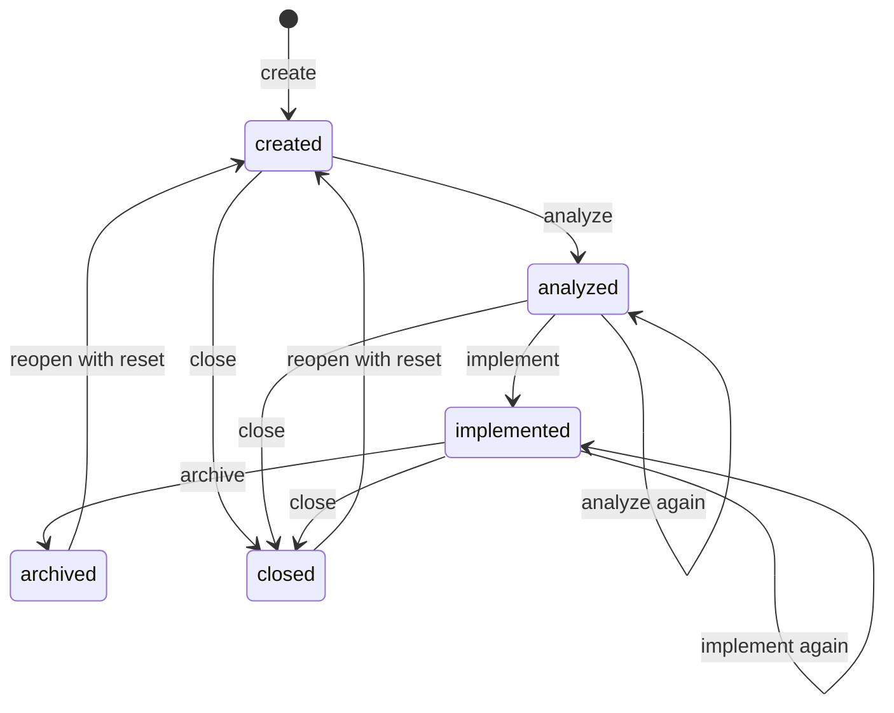

# A spec's lifecycle

A spec moves through four phases. This page says what moves it from one to the next, who records that it moved,
and what has to be true for the move to count. This is the level above [A job's states](job-states.md): a job is one
run of one or more steps, and its `queued`/`running`/`done` says nothing about how far the spec has got.

**Three words, and they are not the same.**

| Word      | What it is                                                                                                                    | Where it is decided                                                                 |
|-----------|-------------------------------------------------------------------------------------------------------------------------------|-------------------------------------------------------------------------------------|
| **Step**  | Anything the queue can run: `create`, `analyze`, `implement`, `archive`, `explore`, `manifest`, `schedule`, `reopen`, `close` | `workflowSteps` in `core/scripts/lib/workflow-steps.json`                           |
| **Phase** | The four steps a spec passes through — `create`, `analyze`, `implement`, `archive`                                            | `workflowArc` in the same file, "deliberately narrower … not places a spec gets to" |
| **State** | Where the spec stands now, in the past tense: `created`, `analyzed`, `implemented`, `archived`, `closed`                      | the `phase` column of `core/scripts/lib/transitions.json`                           |

`close` and `reopen` are steps, not phases: a spec that is `closed` has left the arc rather than reached a fifth
stage of it. Two things about that table are worth knowing before reading it: its column is named `phase` and
holds states, and its `next` value names what the move is allowed to reach, not what the spec then reads as. **A
spec's state is never stored — it is derived from its own files** every time it is asked for: a `**Closed:**`
stamp in effect makes it `closed`, an `**Archived:**` stamp `archived`, and otherwise the `Workflow steps
completed:` line decides between `implemented`, `analyzed` and `created`.

The code is `transitions.json`, read in bash by `may_apply_spec_transition`
(`core/scripts/lib/spec-transitions.sh`) and in TypeScript by `isLegalMove`
(`dashboard/src/queue/spec-transitions.ts`); `completed_steps_for` and the post-step checks in
`core/scripts/lib/run-spec-records.sh` and `run-spec-status-line.sh`; the gates in
`core/scripts/aide-archive-spec`; and the landing in `src/serve/land-branch/`.

## Table of contents

- [The four phases](#the-four-phases)
- [One spec, from first to last](#one-spec-from-first-to-last)
- [What "has had a phase" means](#what-has-had-a-phase-means)
- [The transitions](#the-transitions)
- [When a spec stops, and what moves it on](#when-a-spec-stops-and-what-moves-it-on)
- [How a hold works](#how-a-hold-works)
- [Where the work is between phases](#where-the-work-is-between-phases)
- [Another round on the same spec](#another-round-on-the-same-spec)
- [Going backwards: reopen](#going-backwards-reopen)
- [Closing: a different terminal move from archive](#closing-a-different-terminal-move-from-archive)
- [Which button a row offers](#which-button-a-row-offers)
- [What the list makes of it](#what-the-list-makes-of-it)

---

## The four phases

| Phase       | Writes                                                                                                                   | Lands                                                                                |
|-------------|--------------------------------------------------------------------------------------------------------------------------|--------------------------------------------------------------------------------------|
| `create`    | The spec folder: `0-README.md`, `1-description.md` and empty `2-`, `3-`, `4-` files, via `core/scripts/aide-create-spec` | Merged into the specs repo's default branch at once; the branch is deleted on origin |
| `analyze`   | `2-analysis.md`, `3-solution.md`, `4-status.md`, in the specs repo only                                                  | Merged into the specs repo's default branch at once; the branch is deleted on origin |
| `implement` | Code and tests in the project, the status rows in `4-status.md`, and `test-run.json` beside the spec                     | Nothing. The code waits on `aide/<folder>`                                           |
| `archive`   | The `Archived:` stamp, moves the folder into `archive/`, feeds documentation back                                        | Merges the specs repo, then the code root, runs `AIDE_INSTALL_CMD`, then asks origin |

Other steps exist — `explore`, `manifest`, `schedule`, `reopen`, `close` — but they are not phases: none of
them appears in the workflow arc. `close` and `reopen` do move a spec between STATES, which is why they have rows
in the transition table; they draw no line on a spec's row, which always has the four, and the Logs tab lists them.
They simply do not move a spec along the arc.

## One spec, from first to last

A spec for a change to the dashboard, run on the board, with nothing going wrong:

1. **New spec.** You fill in the form: the project, a title, a description, and the four phases left ticked. The
   job is queued under a provisional name, and the list shows a create running.
2. **Create lands.** The folder gets its number and slug when its branch is merged — `512-a-project-keeps-nothing`
   — and the spec has a row from that moment. Its state is `created`.
3. **Analyze runs**, writes `2-analysis.md` and `3-solution.md` with the acceptance criteria, and lands them in the
   specs repository. The state is `analyzed`, and the row's button now reads Implement.
4. **Implement runs**, writes the code and its tests on `aide/512-…`, and the runner holds it to the project's own
   suite: green ends the step, red goes back to the same session twice before the step fails. Nothing is merged —
   the code waits on the branch. The state is `implemented`.
5. **Archive is held back.** The spec has acceptance criteria, so the job ends `done` without running anything, and
   the row says so. You read the result, tick the rows on the Status tab, and press Archive.
6. **Archive runs and lands.** The folder moves into `archive/`, the documentation feedback is written, and the
   landing merges the code into the default branch once the project's tests pass on the merged result. The state is
   `archived`, and the row leaves the active list.

Anything that goes differently is one of the rows in [When a spec stops, and what moves it on](#when-a-spec-stops-and-what-moves-it-on).

## What "has had a phase" means

One line in the Tracking info of `4-status.md` is the whole record:

```markdown
- **Workflow steps completed:** create, analyze
```

**The runner writes it, not the model**, and it writes a step onto the line only once the step's work is there to
see: code that actually changed for an implement, a folder actually under `archive/` for an archive, nothing
outside its own spec folder for an analyze. A step that ended `stopped` or `failed` is not counted. A spec made by
hand, with no runner commit behind it, has no line and reads as having had nothing.

The checks themselves, and what each one refuses, are in
[The runner and its checkouts](the-runner.md#what-counts-as-a-step-having-run).

What the record does NOT cover: whether the step's commit reached origin, and whether the landing that followed
succeeded. It is rebuilt from local history, so a step whose push was refused is still on it, and a landing that
fails afterwards does not take it off — that reaches the JOB instead, as `done` to `failed`
([A job's states](job-states.md)).

## The transitions



**Into `create`.** `POST /api/queue/create` queues a job whose first step is `create`, followed by whatever else
the New spec form ticked, under a provisional key
(`new-<id>`) that names its branch, its worktree and its folder on disk: `/aide-create` writes its five files under
that literal name, choosing no number and no slug itself. The number and the slug are decided at landing instead,
under the specs repo's own merge lock — the one place two landings for the same repo are already serialized by
construction, so two `create` jobs for the same project can run at once with nothing to collide over. Landing counts
the folders already there, assigns the next number, renames the job's folder to it and rewrites its own `Task:`
lines, all before the merge is pushed. A spec exists once its folder is on the specs repo's default branch — that is
what puts a row on the list.

A `create` that ends without a spec (`failed`, `stopped`, `interrupted`, or a failed merge with no merge under way, and
still under its provisional key) has no row. It leaves a message at the top of the specs list and a push notification,
both offering to try again with what was typed; see [the specs list](the-specs-list.md#a-failed-create).

**`create` to `analyze`.** A spec that has not implemented yet may be analyzed, again and again: `created` and
`analyzed` both take the move — analyzing an analyzed spec simply leaves it analyzed. An `implemented` spec is refused — "analyze would rewrite
a landed plan" — unless a round is under way, which is what changing an acceptance criterion opens; the round gate
is asked first, and a spec that passes it has already moved back before the refusal could apply. The row's boxes
follow whatever was
posted from New spec at create time — every phase by default, fewer if the reader unticked one — so an untouched
create queues analyze, implement and archive as one job. The runner queues each following step the moment the one
before it completes, and starts it once that step's landing has settled. Until then, that step's own phase line and
duration read as still going, not as done — see [Beside the state](job-states.md#beside-the-state).

**`analyze` to `implement`.** A spec that has not analyzed is refused — `not-analyzed-yet`, "run /aide-analyze
first" — by the runner's own gate before the step starts, and by the queue before that, which holds the job
`queued` with that reason on its row rather than starting it. An `analyzed` or `implemented` spec takes the move,
and running implement on an implemented spec leaves it implemented, so a re-run needs no gate of its own. A dependency that has not archived holds it back
too — see the next section. Beyond those, nothing is checked: an `implement` run against an empty `3-solution.md`
is refused by the skill, not by the queue.

**`implement` to `archive`.** `core/scripts/aide-archive-spec` runs before any model is spawned and decides in this
order, stopping at the first that applies:

| Outcome                        | Meaning                                                                                         |
|--------------------------------|-------------------------------------------------------------------------------------------------|
| `refused`                      | Bad arguments, or the spec cannot be found                                                      |
| `already-archived`             | The folder is under `archive/` already — idempotent, Step 2 of the skill still runs             |
| `conflict-open`                | The branch could not be brought up to date with the default branch; the model resolves it       |
| `not-implemented-yet`          | `implement` is not on the completed line                                                        |
| `acceptance-criteria-unticked` | A row under `## Acceptance criteria` in `4-status.md` is still open — only a user ticks those   |

The acceptance criteria live in two files, and the difference matters when an archive is held back. The criteria
themselves — the `AC-n` lines saying what done means — are written in `1-description.md`, and that is the file you
edit to change one. The tick rows are in `4-status.md`, one per criterion, and that is what the gate reads. You
tick them on the spec's **Status** tab, or under the › on its row, and press Archive when they are all settled.
| `archived`                     | Stamped and moved; the landing follows                                                          |

Four of the five outcomes short of `archived` end the step with no model run at all: `refused`,
`already-archived`, `not-implemented-yet` and `acceptance-criteria-unticked`. `conflict-open` and `archived` spawn
one, for the conflict and for the documentation feedback respectively. An `acceptance-criteria-unticked` archive
often never reaches the script: the runner ends a queued one on the spot, with that outcome, no process and no
cost.

An Acceptance row marked `Not verified` counts as ticked for `acceptance-criteria-unticked`: a check that can only be
made after deploy does not hold the archive back, and the spec keeps showing it until the row is ticked. A row marked
`Failed` is open and does hold it back; Reopen (without reset) sets such rows back to open and leaves their `Failed:`
notes, which `roundGate` reads as a changed criterion.

`acceptance-criteria-unticked` never applies to a spec created with the "acceptance ticking not required" switch.
The switch itself is a `- **Acceptance:** not required` line in `1-description.md`'s Tracking info; its effect is
that the analyze session writes one plain sentence under `## Acceptance criteria` in `4-status.md` instead of a
table, and a section with no row is not one this gate can find open.

**`archive`'s landing** merges the specs repo, then the code root, runs `AIDE_INSTALL_CMD` after a code root, and then
asks origin whether `aide/<folder>` is still there. A root that still holds it is a landing that did not finish: the
job goes `failed` with `errorReason: "unlanded"`, and the spec keeps a row on the default view wearing "not landed"
until `archive` is run again — see [Branches and landing](landing.md).

## When a spec stops, and what moves it on

Every stop writes its own sentence onto the spec's row, and most of them end by naming the button to press. This
is the whole set:

| What the row says                     | What happened                                                                      | What moves it on                                                    |
|---------------------------------------|------------------------------------------------------------------------------------|---------------------------------------------------------------------|
| held back: not analyzed yet           | The spec has not analyzed, and implement needs a plan                              | Run Analyze                                                         |
| held back: depends on `<spec>`        | A spec it names has not archived yet                                               | Nothing. It starts itself once that spec archives                   |
| held back: another archive is running | A second archive in the same project is ahead of it                                | Nothing. It starts when that one has merged                         |
| archive held back                     | A row under `## Acceptance criteria` is still open                                 | Tick the rows on the Status tab, then press Archive                 |
| stopped: no-progress                  | The step said it succeeded but changed nothing in the project                      | Press the same button again                                         |
| stopped: merge-unfinished             | The step dropped the merge with the default branch it was handed open              | Press the same button again                                         |
| stopped: scope-violation              | The step wrote outside its own spec folder, or claimed a step it did not run       | Press the same button again                                         |
| stopped: tests-red                    | The project's suite is red, after the runner gave the session two more turns at it | Make the suite green, then press Implement                          |
| stopped: timeout                      | The step reached its own time limit                                                | Press the same button again; the work it committed is on the branch |
| not landed                            | Archive finished, but the spec's branch is still on origin                         | Run Archive again                                                   |
| conflict                              | A merge conflict no machine could settle                                           | Resolve it yourself, with the diff in front of you                  |

An archived or closed spec refuses every step but Reopen, whatever is ticked on its row.

## How a hold works

Three of the rows above are holds rather than stops: nothing failed, and the job is still queued.

- **A dependency.** `Depends on:` in `1-description.md` names other specs. `implement` and `archive` are held back
  while any of them still has a branch on origin carrying commits the default branch does not — which is until that
  spec's own `archive` lands. The dashboard leaves the job `queued` with the reason on its row and tries again on
  every pass of the runner; a run started by hand is refused. `create` and `analyze` run regardless.
- **Another job on the same spec.** Two jobs for one spec never run at once.
- **That job's own landing.** A job with `landing` set does not start its next step until its merge settles.
  Every other job runs as usual: the landing merges in a worktree of its own.
- **An archived or closed spec.** The server refuses every step but `reopen` for it (`ARCHIVE_ONLY_STEP`).

## Where the work is between phases

| After       | Specs repo                                               | Project                                                                        |
|-------------|----------------------------------------------------------|--------------------------------------------------------------------------------|
| `create`    | Folder on the default branch                             | Untouched                                                                      |
| `analyze`   | Analysis, plan and status on the default branch          | Untouched                                                                      |
| `implement` | Status rows on `aide/<folder>` — implement lands nothing | Code on `aide/<folder>`, pushed to origin                                      |
| `archive`   | Folder under `archive/` on the default branch            | Code on the default branch, or a pull request left open when `codeLanding: pr` |

`implement` is the one phase whose work is deliberately left on its branch, in both repos: the branch is the
inspection point, and `archive` is what lands it. A project that sets `codeLanding: pr` in its manifest keeps the CODE
root's branch open through `archive` too, as the pull request; the specs root still lands.

## Another round on the same spec

A spec whose acceptance criteria are not all ticked, or that was reopened with its files kept, can take another round of analysis or implementation without being
reopened. It is the one way back that keeps everything: the analysis, the plan, the status and every ticked
row stay as they are.

- **The round begins where archive declines.** `aide-archive-spec` refuses an archive while any row under
  `## Acceptance criteria` in `4-status.md` is open, and at that moment writes
  `- **Round boundary:** <date> (history before <sha> does not count)` into `4-status.md`. A second decline with
  nothing changed in between writes nothing; a later real round appends its own, and the last one is the one read.
- **The user edits the criteria.** The open `AC-n` rows in `1-description.md` are rewritten to say more precisely what
  was missing, or new ones are added.
- **Analyze or Implement then runs again on the same active spec — once at least one criterion is new or reworded
  since the boundary.** The server compares each open row's text in `1-description.md` with its text at the
  boundary's commit (`roundGate`, `src/project/parse-status/held-back.ts`), and refuses the round only when none has
  changed and none was added: a round on the same words would give the same result. The other open criteria may stay
  as they are.
- **The round touches only what is open.** Analyze appends a `## Round N` section to `2-analysis.md` and
  `3-solution.md` for the open and new ids, and `4-status.md` gains a row for each new id; no existing row's text or
  tick changes. A ticked criterion is approved, and nothing in the round traces to it. Implement may rewrite an open
  row's Notes cell with what is still missing. No skill ticks a row.
- **On the specs list**, a spec held back this way offers Analyze and Implement unticked beside a ticked Archive: a
  plain press archives, and another round is a choice made by ticking it.

When the user is satisfied, they tick the rows on the spec's Status tab and press Archive.

## Going backwards: reopen

Reopen keeps the spec, and discards a work round when it is asked to. It is a skill (`/aide-reopen`) at a keyboard and a
queue step the dashboard presses, never a step the runner decides on its own.

- **Reopen** takes an archived or closed spec back to the active list and asks one question on its own page
  (`/specs/<project>/<spec>/reopen`, reached from the Reopen link on the spec page and from the list row): also reset
  the analysis, the plan and the status? The box is unticked, and the job carries `resetFiles` only when it is ticked.
  Pressing Reopen opens a "Reopening…" dialog that stands until the job has settled.
  It deletes the branch the earlier round left behind in both modes.
  - **Keep (the default, also a bare `steps=reopen`).** `core/scripts/aide-reopen-spec` moves the folder out of
    `archive/` and runs no model. `0-README.md` to `3-solution.md` are untouched; in `4-status.md` `archive` leaves the
    `Workflow steps completed:` line and a `**Round boundary:**` stamp is appended. The spec ends in the state its files
    show (`implemented` for a spec that was implemented), not in `created`, and it takes the round described above: it
    is read as reopened while its last `**Archived:**` or `**Closed:**` stamp is followed by a `**Round boundary:**`
    stamp with no `**Reopened:**` or `**Reset:**` mark between (`reopenedRound`, `held-back.ts`). Analyze and Implement
    are accepted once one criterion is new, or reworded with its row unticked, since that boundary; the specs list
    offers them unticked beside a ticked Archive.
  - **Reset (`resetFiles`, runner flag `--reset-files`).** No model here either: `aide-reopen-spec` moves the folder
    back and `aide-reset-spec` then writes `2-analysis.md`, `3-solution.md` and `4-status.md` from the templates,
    keeping `0-README.md` and `1-description.md`. The step records
    `- **Reopened:** <date> (history before <sha> does not count)` in `4-status.md`. The sha is the boundary
    `completed_steps_for` counts from: runner commits before it are the old round's and no longer put a step on the
    line. It drops the spec's recorded phase choice too: those ticks belonged to the round just discarded.

  A stamp only counts while nothing later cancels it: an `**Archived:**` or `**Closed:**` line followed by a
  `**Round boundary:**`, `**Reopened:**` or `**Reset:**` mark is history, and the spec reads as active again. A new
  stamp after that boundary counts. [The runner and its checkouts](the-runner.md#what-counts-as-a-step-having-run)
  has which readers apply that rule.
There is no `reset` step for an ACTIVE spec: another round covers that, and a reopen with its reset covers the
rest. A `**Reset:**` stamp is still read where an older job left one, so such a spec keeps its boundary.

A spec reopened with reset reads as `created` again: the line is empty until a step runs. It also drops the phase
choice recorded under the spec (`pending-steps.json`): the ticks belonged to the round just discarded, so the row falls
back to every phase the spec has not had and its button reads Analyze. A reopen that keeps the files keeps the choice
as it was.

## Closing: a different terminal move from archive

`close` reaches the state `closed` from `created`, `analyzed` or `implemented` — every state Archive would refuse,
since Close carries no `not-implemented-yet`/`acceptance-criteria-unticked` gate. `core/scripts/aide-close-spec`
writes a
`**Closed:** <date> — <reason>` stamp (the reason is required) and moves the folder into `archive/`, exactly as
`aide-archive-spec` does — but its landing deletes the code root's branch instead of merging it, since Close records
that the work will not be used, not that it was. **Whatever code that branch held is gone with it**, and a later
reopen does not bring it back — the spec's four files return, the code does not. A closed spec reads `closed`, never `archived`, everywhere a spec's
state is shown, and only `reopen` is legal on it afterward — the same one-step exception `archived` already has.

## Which button a row offers

The row carries one control at a time, on the caption line inside the fold. While nothing of the spec is running it
is the run button, **labelled with the phase it would run** — Analyze, Implement, Archive — and greyed out, still
named, when that phase is unticked. While a step runs it is Cancel instead, and while `create` runs there is no
button at all: cancelling it would throw away the title and the description with no spec left to run again from.

An archived or closed row has one control only, **Reopen**, since the server refuses every other step for it.

## What the list makes of it

The row's state is one of: `not-started` (the spec has no job at all), the state of its most recent or in-flight job
(`queued`, `running`, `done`, `stopped`, `failed`, `cancelled`, `interrupted`), `archived`, `archived-unlanded`
(archived with its branch still on origin), or `closed` — except that a job whose branch is still landing reads as
`running` for this purpose regardless of its own state, so a still-merging spec sits with the ones still going rather
than the ones waiting on a press. The chips group those — "All" is the default, "Active" is everything not archived
and not closed, "Running" only `running` (landing included, `queued` excluded), "Waiting" (`queued` or `done`,
with no landing in progress), "Stopped", "Failed" (the three other failure states and `archived-unlanded`),
"Archived" (both archived states), "Closed" and "Not verified".

**That list is a job's state, not the spec's.** `archived` and `closed` appear in both vocabularies and mean the
same thing; the rest — `queued`, `running`, `done`, `stopped`, `failed`, `cancelled`, `interrupted` — belong to the
job, and say nothing about how far the spec has got. Which PHASE a spec has reached is read off the completed line
and drawn as the four marks beside its name — see
[The specs list and the spec page](the-specs-list.md).
