# A spec's lifecycle

The one place the SPEC's progression is written down: the four phases `create`, `analyze`, `implement` and
`archive`, what moves a spec from one to the next, who records that it moved, and what has to be true for the move to
count. This is the level above [A job's states](job-states.md): a job is one run of one or more phases, and its
`queued`/`running`/`done` says nothing about how far the spec has got. The code is `completed_steps_for` and the
post-step checks in `core/scripts/aide-run-spec`, the gates in `core/scripts/aide-archive-spec`, and the landing in
`src/serve/land-branch/`.

## Table of contents

- [The four phases](#the-four-phases)
- [What "has had a phase" means](#what-has-had-a-phase-means)
- [The transitions](#the-transitions)
- [What holds a phase back](#what-holds-a-phase-back)
- [Where the work is between phases](#where-the-work-is-between-phases)
- [Going backwards: reopen and reset](#going-backwards-reopen-and-reset)
- [What the list makes of it](#what-the-list-makes-of-it)

---

## The four phases

| Phase       | Writes                                                                                                                   | Lands                                                                                |
|-------------|--------------------------------------------------------------------------------------------------------------------------|--------------------------------------------------------------------------------------|
| `create`    | The spec folder: `0-README.md`, `1-description.md` and empty `2-`, `3-`, `4-` files, via `core/scripts/aide-create-spec` | Merged into the specs repo's default branch at once; the branch is deleted on origin |
| `analyze`   | `2-analysis.md`, `3-solution.md`, `4-status.md`, in the specs repo only                                                  | Merged into the specs repo's default branch at once; the branch is deleted on origin |
| `implement` | Code and tests in the project, the status rows in `4-status.md`, and `test-run.json` beside the spec                     | Nothing. The code waits on `aide/<folder>`                                           |
| `archive`   | The `Archived:` stamp, moves the folder into `archive/`, feeds documentation back                                        | Merges the specs repo, then the code root, runs `AIDE_INSTALL_CMD`, then asks origin |

Other steps exist — `explore`, `manifest`, `schedule`, `reopen` — but they are not phases: none of them appears in the
workflow arc, and none moves the spec along it.

## What "has had a phase" means

One line in the Tracking info of `4-status.md` is the whole record:

```markdown
- **Workflow steps completed:** create, analyze
```

**The runner writes it, not the model.** After every step, `completed_steps_for` in `core/scripts/aide-run-spec`
rebuilds the line from the specs repo's own history: the commits whose subject reads `Run /aide-<step> for <folder>`
since the current work round began, plus the step that has just completed. A step that ended `stopped` or `failed`
is committed with the reason in its subject (`(stopped: budget)`) and is not counted. A spec made by hand, with no runner commit behind it, has no line and
reads as having had nothing — deliberately, because a spec that reads as unfinished is fixed by running the step, where
a guess is not.

**A step's own claim of success is cross-checked before it counts**, because the model's turn ending cleanly is not
evidence that the phase happened:

- `implement` counts only if the project's HEAD moved or its tree changed. Otherwise the step ends `no-progress` and
  the line is not extended.
- `archive` counts only if the folder is under `archive/` afterwards. Otherwise `no-progress`.
- `analyze` is refused as `scope-violation` if it changed the project, advanced a status row, or wrote a step onto the
  line that it did not run.

What the cross-check does not cover: whether the step's commit reached origin, and whether the landing that follows
succeeded. The line is rebuilt from local history, so a step whose push was refused is still on it, and a landing that
fails afterwards does not take it off. `job-states.md` describes how such a landing reaches the JOB (`done` to `failed`
with an `errorReason`); the spec's own record is unchanged by it.

## The transitions

```mermaid
stateDiagram-v2
    [*] --> created: create lands, job renamed to the folder
    created --> analyzed: analyze completes and lands
    analyzed --> implemented: implement completes; code stays on its branch
    implemented --> archived: archive moves the folder and lands every repo
    archived --> created: reopen (a new work round)
    analyzed --> created: reset (same round discarded)
    implemented --> created: reset
```



**Into `create`.** `POST /api/queue/create` queues a job with the single step `create`, under a provisional key
(`new-<id>`) that names its branch and worktree. `/aide-create` decides the number and the slug; `aide-run-spec`
reports the folder that appeared as `specFolder`, and the dashboard lands the branch and renames the job to it. A
spec exists once its folder is on the specs repo's default branch — that is what puts a row on the list.

**`create` to `analyze`.** Any spec on the list may be analyzed; there is no gate. The row pre-ticks every phase the
spec has not had, so a fresh spec's Run queues analyze, implement and archive as one job. The runner queues each following step the moment the one
before it completes, and starts it once that step's landing has settled.

**`analyze` to `implement`.** Held back while a dependency is unmerged — see the next section. Nothing else is
checked: an `implement` run against an empty `3-solution.md` is refused by the skill, not by the queue.

**`implement` to `archive`.** `core/scripts/aide-archive-spec` runs before any model is spawned and decides in this
order, stopping at the first that applies:

| Outcome                        | Meaning                                                                                         |
|--------------------------------|-------------------------------------------------------------------------------------------------|
| `refused`                      | Bad arguments, or the spec cannot be found                                                      |
| `already-archived`             | The folder is under `archive/` already — idempotent, Step 2 of the skill still runs             |
| `conflict-open`                | The branch could not be brought up to date with the default branch; the model resolves it       |
| `not-implemented-yet`          | `implement` is not on the completed line                                                        |
| `acceptance-criteria-unticked` | A row under `## Acceptance criteria` in `4-status.md` is still open — only a person ticks those |
| `archived`                     | Stamped and moved; the landing follows                                                          |

The first four outcomes short of `archived` end the step without a model run. `conflict-open` and `archived` spawn
one, for the conflict and for the documentation feedback respectively.

**`archive`'s landing** merges the specs repo, then the code root, runs `AIDE_INSTALL_CMD` after a code root, and then
asks origin whether `aide/<folder>` is still there. A root that still holds it is a landing that did not finish: the
job goes `failed` with `errorReason: "unlanded"`, and the spec keeps a row on the default view wearing "not landed"
until `archive` is run again — see [Branches and landing](landing.md).

## What holds a phase back

- **A dependency.** `Depends on:` in `1-description.md` names other specs. `implement` and `archive` are held back
  while any of them still has a branch on origin carrying commits the default branch does not — which is until that
  spec's own `archive` lands. The dashboard leaves the job `queued` with the reason on its row and tries again every
  tick; a run started by hand is refused. `create` and `analyze` run regardless.
- **Another job on the same spec.** Two jobs for one spec never run at once.
- **A landing in progress, anywhere.** Nothing starts while any job has `landing` set.
- **The caps.** A job cap stops the job before the step; the daily cap parks it — [A job's states](job-states.md).
- **An archived spec.** The server refuses every step but `reopen` for it (`ARCHIVE_ONLY_STEP`).

## Where the work is between phases

| After       | Specs repo                                               | Project                                                                        |
|-------------|----------------------------------------------------------|--------------------------------------------------------------------------------|
| `create`    | Folder on the default branch                             | Untouched                                                                      |
| `analyze`   | Analysis, plan and status on the default branch          | Untouched                                                                      |
| `implement` | Status rows on `aide/<folder>` — implement lands nothing | Code on `aide/<folder>`, pushed to origin                                      |
| `archive`   | Folder under `archive/` on the default branch            | Code on the default branch, or a pull request left open when `codeLanding: pr` |

`implement` is the one phase whose work is deliberately left on its branch, in both repos: the branch is the
inspection point, and `archive` is what lands it. A project that sets `codeLanding: pr` in its manifest keeps the CODE
root's branch open through `archive` too, as the pull request; the specs root still lands.

## Going backwards: reopen and reset

Both discard a work round and keep the spec. Both are skills (`/aide-reopen`, `/aide-reset`), not queue steps the
runner decides on its own.

- **Reopen** takes an archived spec back to the active list. It deletes the branch the earlier round left behind,
  records `- **Reopened:** <date> (history before <sha> does not count)` in `4-status.md`, and resets `2-analysis.md`,
  `3-solution.md` and `4-status.md` while keeping `0-README.md` and `1-description.md`. The sha is the boundary
  `completed_steps_for` counts from: runner commits before it are the old round's and no longer put a step on the line.
- **Reset** does the same for an active spec whose current round must not count, keeping the description, the commits
  and the earlier job history.

A reopened or reset spec therefore reads as `created` again: the line is empty until a step runs, and the row pre-ticks
every phase.

## What the list makes of it

The row's state is one of: `not-started` (the spec has no job at all), the state of its most recent or in-flight job
(`queued`, `running`, `done`, `stopped`, `failed`, `cancelled`, `interrupted`), `archived`, or `archived-unlanded`
(archived with its branch still on origin). The chips group those — "All" is the default, "Active" is everything not
archived, "Running" the in-flight states, "Done", "Problems" (the four failure states and `archived-unlanded`) and
"Archived" (both archived states). Which PHASE a spec has reached is not a state on that axis: it is read off the
completed line and drawn as the pips and the resting-state sentence ("ready for implement") — see
[The specs list and the spec page](the-specs-list.md).
