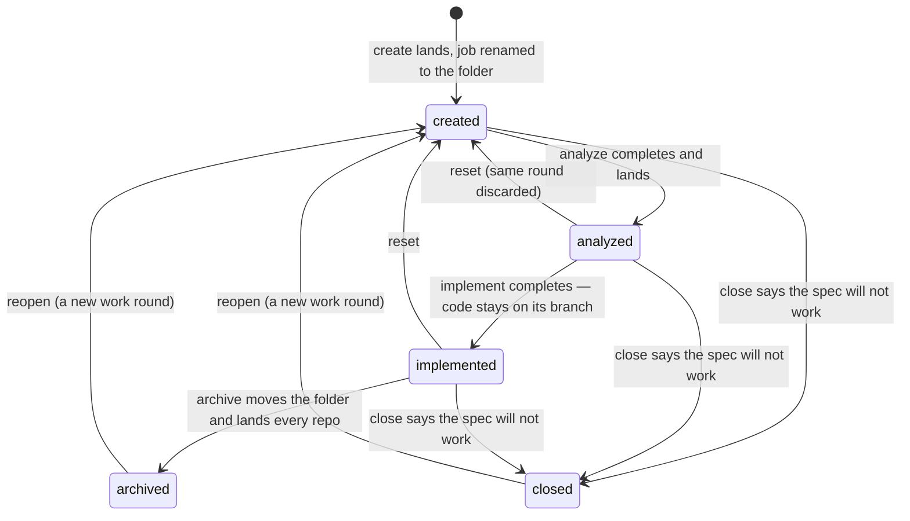

# A spec's lifecycle

The one place the SPEC's progression is written down: the four phases `create`, `analyze`, `implement` and
`archive`, what moves a spec from one to the next, who records that it moved, and what has to be true for the move to
count. This is the level above [A job's states](job-states.md): a job is one run of one or more phases, and its
`queued`/`running`/`done` says nothing about how far the spec has got. The code is `completed_steps_for` and the
post-step checks in `core/scripts/aide-run-spec`, the gates in `core/scripts/aide-archive-spec`, and the landing in
`src/serve/land-branch/`.

## Table of contents

- [The four phases](#the-four-phases)
- [What "has had a phase" means](#what-has-had-a-phase-means)
- [The transitions](#the-transitions)
- [What holds a phase back](#what-holds-a-phase-back)
- [Where the work is between phases](#where-the-work-is-between-phases)
- [Another round on the same spec](#another-round-on-the-same-spec)
- [Going backwards: reopen and reset](#going-backwards-reopen-and-reset)
- [Closing: a different terminal move from archive](#closing-a-different-terminal-move-from-archive)
- [What the list makes of it](#what-the-list-makes-of-it)

---

## The four phases

| Phase       | Writes                                                                                                                   | Lands                                                                                |
|-------------|--------------------------------------------------------------------------------------------------------------------------|--------------------------------------------------------------------------------------|
| `create`    | The spec folder: `0-README.md`, `1-description.md` and empty `2-`, `3-`, `4-` files, via `core/scripts/aide-create-spec` | Merged into the specs repo's default branch at once; the branch is deleted on origin |
| `analyze`   | `2-analysis.md`, `3-solution.md`, `4-status.md`, in the specs repo only                                                  | Merged into the specs repo's default branch at once; the branch is deleted on origin |
| `implement` | Code and tests in the project, the status rows in `4-status.md`, and `test-run.json` beside the spec                     | Nothing. The code waits on `aide/<folder>`                                           |
| `archive`   | The `Archived:` stamp, moves the folder into `archive/`, feeds documentation back                                        | Merges the specs repo, then the code root, runs `AIDE_INSTALL_CMD`, then asks origin |

Other steps exist — `explore`, `manifest`, `schedule`, `reopen`, `reset`, `close` — but they are not phases: none of
them appears in the workflow arc, and none moves the spec along it.

## What "has had a phase" means

One line in the Tracking info of `4-status.md` is the whole record:

```markdown
- **Workflow steps completed:** create, analyze
```

**The runner writes it, not the model.** After every step, `completed_steps_for` in `core/scripts/aide-run-spec`
rebuilds the line from the specs repo's own history: the commits whose subject reads `Run /aide-<step> for <folder>`
since the current work round began, plus the step that has just completed. A step that ended `stopped` or `failed`
is committed with the reason in its subject (`(stopped: timeout)`) and is not counted. A spec made by hand, with no runner commit behind it, has no line and
reads as having had nothing — deliberately, because a spec that reads as unfinished is fixed by running the step, where
a guess is not.

**A step's own claim of success is cross-checked before it counts**, because the model's turn ending cleanly is not
evidence that the phase happened:

- `implement` counts only if the project's HEAD moved or its tree changed. Otherwise the step ends `no-progress` and
  the line is not extended. It also ends only on a green test run the runner made ITSELF
  (`run-spec-step-tests.sh`): the same `aide-resolve-test-cmd` and `aide-record-test-run` the landing's gate calls run
  on the step's result in its worktree, and the record on the branch is the runner's. Red goes back to the same
  session first — the failing lines as a follow-up turn, up to two more rounds within what is left of the step's
  time limit (`AIDE_TEST_FIX_ROUNDS`; claude resumes its session, Codex its thread through `codex exec resume`). Still red after
  that, the step ends `tests-red` with the failing lines as its detail, and Implement is the button to press again.
  A change no test command covers has nothing to run and passes as before. A record the session wrote through
  `aide-record-test-run` on exactly the delivered tree (its `tree` hash), green and naming the same commands, is
  accepted as that run; anything the session changed afterwards makes the runner run the suite itself.
- `archive` ends on the same green run when its pull merged main into the branch (a fast-forward brought
  nothing new, and nothing is run): the suite runs on the merged result, red goes back to the archive session the
  same way, and still red ends the step `tests-red` with Archive as the button. The record is written into the
  folder under `archive/`.
- `archive` counts only if the folder is under `archive/` afterwards. A folder that stayed put because
  `aide-archive-spec` refused (`not-implemented-yet`, `acceptance-criteria-unticked`) ends as that refusal, the same
  as when the refusal came before the session; otherwise `no-progress`. An archive handed a merge with the default
  branch OPEN (`update_branch_to_base`) counts only if the branch contains that base tip afterwards — a session
  that aborted the merge and still moved the folder ends `merge-unfinished`, since the landing would meet the same
  conflict again.
- `analyze` is refused as `scope-violation` if it changed the project, advanced a status row, or wrote a step onto the
  line that it did not run.

What the cross-check does not cover: whether the step's commit reached origin, and whether the landing that follows
succeeded. The line is rebuilt from local history, so a step whose push was refused is still on it, and a landing that
fails afterwards does not take it off. `job-states.md` describes how such a landing reaches the JOB (`done` to `failed`
with an `errorReason`); the spec's own record is unchanged by it.

## The transitions



**Into `create`.** `POST /api/queue/create` queues a job with the single step `create`, under a provisional key
(`new-<id>`) that names its branch, its worktree and its folder on disk: `/aide-create` writes its five files under
that literal name, choosing no number and no slug itself. The number and the slug are decided at landing instead,
under the specs repo's own merge lock — the one place two landings for the same repo are already serialized by
construction, so two `create` jobs for the same project can run at once with nothing to collide over. Landing counts
the folders already there, assigns the next number, renames the job's folder to it and rewrites its own `Task:`
lines, all before the merge is pushed. A spec exists once its folder is on the specs repo's default branch — that is
what puts a row on the list.

A `create` that ends without a spec (`failed`, `stopped`, `interrupted`, or a failed merge with no merge under way, and
still under its provisional key) has no row. It leaves a message at the top of the specs list and a push notification,
both offering to try again with what was typed; see [the specs list](the-specs-list.md#a-failed-create).

**`create` to `analyze`.** Any spec on the list may be analyzed; there is no gate. The row's boxes follow whatever was
posted from New spec at create time — every phase by default, fewer if the reader unticked one — so an untouched
create queues analyze, implement and archive as one job. The runner queues each following step the moment the one
before it completes, and starts it once that step's landing has settled. Until then, that step's own phase line and
duration read as still going, not as done — see [Beside the state](job-states.md#beside-the-state).

**`analyze` to `implement`.** Held back while a dependency is unmerged — see the next section. Nothing else is
checked: an `implement` run against an empty `3-solution.md` is refused by the skill, not by the queue.

**`implement` to `archive`.** `core/scripts/aide-archive-spec` runs before any model is spawned and decides in this
order, stopping at the first that applies:

| Outcome                        | Meaning                                                                                         |
|--------------------------------|-------------------------------------------------------------------------------------------------|
| `refused`                      | Bad arguments, or the spec cannot be found                                                      |
| `already-archived`             | The folder is under `archive/` already — idempotent, Step 2 of the skill still runs             |
| `conflict-open`                | The branch could not be brought up to date with the default branch; the model resolves it       |
| `not-implemented-yet`          | `implement` is not on the completed line                                                        |
| `acceptance-criteria-unticked` | A row under `## Acceptance criteria` in `4-status.md` is still open — only a user ticks those   |
| `archived`                     | Stamped and moved; the landing follows                                                          |

The first four outcomes short of `archived` end the step without a model run. `conflict-open` and `archived` spawn
one, for the conflict and for the documentation feedback respectively.

`acceptance-criteria-unticked` never applies to a run started with the "acceptance ticking not required" switch: its
`4-status.md` carries a one-line note under `## Acceptance criteria` instead of a row, and a section with no row is
not one this gate can find open.

**`archive`'s landing** merges the specs repo, then the code root, runs `AIDE_INSTALL_CMD` after a code root, and then
asks origin whether `aide/<folder>` is still there. A root that still holds it is a landing that did not finish: the
job goes `failed` with `errorReason: "unlanded"`, and the spec keeps a row on the default view wearing "not landed"
until `archive` is run again — see [Branches and landing](landing.md).

## What holds a phase back

- **A dependency.** `Depends on:` in `1-description.md` names other specs. `implement` and `archive` are held back
  while any of them still has a branch on origin carrying commits the default branch does not — which is until that
  spec's own `archive` lands. The dashboard leaves the job `queued` with the reason on its row and tries again every
  tick; a run started by hand is refused. `create` and `analyze` run regardless.
- **Another job on the same spec.** Two jobs for one spec never run at once.
- **A landing in progress, anywhere.** Nothing starts while any job has `landing` set.
- **An archived or closed spec.** The server refuses every step but `reopen` for it (`ARCHIVE_ONLY_STEP`).

## Where the work is between phases

| After       | Specs repo                                               | Project                                                                        |
|-------------|----------------------------------------------------------|--------------------------------------------------------------------------------|
| `create`    | Folder on the default branch                             | Untouched                                                                      |
| `analyze`   | Analysis, plan and status on the default branch          | Untouched                                                                      |
| `implement` | Status rows on `aide/<folder>` — implement lands nothing | Code on `aide/<folder>`, pushed to origin                                      |
| `archive`   | Folder under `archive/` on the default branch            | Code on the default branch, or a pull request left open when `codeLanding: pr` |

`implement` is the one phase whose work is deliberately left on its branch, in both repos: the branch is the
inspection point, and `archive` is what lands it. A project that sets `codeLanding: pr` in its manifest keeps the CODE
root's branch open through `archive` too, as the pull request; the specs root still lands.

## Another round on the same spec

A spec whose acceptance criteria are not all ticked can take another round of analysis or implementation without being
reopened or reset. It is the one way back that keeps everything: the analysis, the plan, the status and every ticked
row stay as they are.

- **The round begins where archive declines.** `aide-archive-spec` refuses an archive while any row under
  `## Acceptance criteria` in `4-status.md` is open, and at that moment writes
  `- **Round boundary:** <date> (history before <sha> does not count)` into `4-status.md`. A second decline with
  nothing changed in between writes nothing; a later real round appends its own, and the last one is the one read.
- **The user edits the criteria.** The open `AC-n` rows in `1-description.md` are rewritten to say more precisely what
  was missing, or new ones are added.
- **Analyze or Implement then runs again on the same active spec — once at least one criterion is new or reworded
  since the boundary.** The server compares each open row's text in `1-description.md` with its text at the
  boundary's commit (`roundGate`, `src/project/parse-status/held-back.ts`), and refuses the round only when none has
  changed and none was added: a round on the same words would give the same result. The other open criteria may stay
  as they are.
- **The round touches only what is open.** Analyze appends a `## Round N` section to `2-analysis.md` and
  `3-solution.md` for the open and new ids, and `4-status.md` gains a row for each new id; no existing row's text or
  tick changes. A ticked criterion is approved, and nothing in the round traces to it. Implement may rewrite an open
  row's Notes cell with what is still missing. No skill ticks a row.
- **On the specs list**, a spec held back this way offers Analyze and Implement unticked beside a ticked Archive: a
  plain press archives, and another round is a choice made by ticking it.

When the user is satisfied, they tick the rows on the spec's Status tab and press Archive.

## Going backwards: reopen and reset

Both discard a work round and keep the spec. Both are skills (`/aide-reopen`, `/aide-reset`), not queue steps the
runner decides on its own.

- **Reopen** takes an archived spec back to the active list. It deletes the branch the earlier round left behind,
  records `- **Reopened:** <date> (history before <sha> does not count)` in `4-status.md`, and resets `2-analysis.md`,
  `3-solution.md` and `4-status.md` while keeping `0-README.md` and `1-description.md`. The sha is the boundary
  `completed_steps_for` counts from: runner commits before it are the old round's and no longer put a step on the line.
- **Reset** does the same for an active spec whose current round must not count, keeping the description, the commits
  and the earlier job history. It needs no model: `core/scripts/aide-reset-spec` writes the three files from the
  templates, and a headless `reset` step runs that script directly, the way a create with no AI already writes its
  spec — the step ends in seconds and reports its tool as `none`.

A reopened or reset spec therefore reads as `created` again: the line is empty until a step runs. A reset also drops
the phase choice recorded under the spec (`pending-steps.json`): the ticks belonged to the round just discarded, so
the row falls back to every phase the spec has not had and its button reads Analyze. A reopen keeps the choice as it
was.

## Closing: a different terminal move from archive

`close` reaches `closed` from `created`, `analyzed` or `implemented` — any phase Archive would refuse, since Close
carries no `not-implemented-yet`/`acceptance-criteria-unticked` gate. `core/scripts/aide-close-spec` writes a
`**Closed:** <date> — <reason>` stamp (the reason is required) and moves the folder into `archive/`, exactly as
`aide-archive-spec` does — but its landing deletes the code root's branch instead of merging it, since Close records
that the work will not be used, not that it was. A closed spec reads `closed`, never `archived`, everywhere a spec's
state is shown, and only `reopen` is legal on it afterward — the same one-step exception `archived` already has.

## What the list makes of it

The row's state is one of: `not-started` (the spec has no job at all), the state of its most recent or in-flight job
(`queued`, `running`, `done`, `stopped`, `failed`, `cancelled`, `interrupted`), `archived`, `archived-unlanded`
(archived with its branch still on origin), or `closed` — except that a job whose branch is still landing reads as
`running` for this purpose regardless of its own state, so a still-merging spec sits with the ones still going rather
than the ones waiting on a press. The chips group those — "All" is the default, "Active" is everything not archived
and not closed, "Running" only `running` (landing included, `queued` excluded), "Waiting" (`queued` or `done`, with
no landing in progress), "Stopped", "Failed" (the three other failure states and `archived-unlanded`), "Archived"
(both archived states) and "Closed" (`closed` has its own chip now, rather than being reachable only from "All").
Which PHASE a spec has reached is not a state on that axis:
it is read off the completed line and drawn as the pips and the resting-state sentence ("ready for implement") — see
[The specs list and the spec page](the-specs-list.md).
