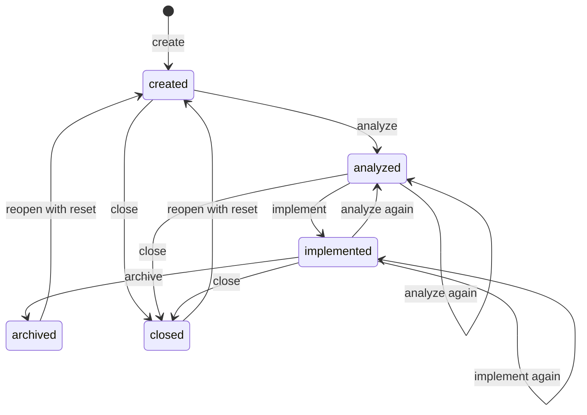

# How a spec moves between phases

## Table of contents

- [What "has had a phase" means](#what-has-had-a-phase-means)
- [The transitions](#the-transitions)
- [How a hold works](#how-a-hold-works)
- [Where the work is between phases](#where-the-work-is-between-phases)
- [Which button a row offers](#which-button-a-row-offers)
- [What the list makes of it](#what-the-list-makes-of-it)

---

This page is for changing the code: what moves a spec from one phase to the next, who records that it moved, and
what has to be true for the move to count. The same phases from the side of someone using the board are in
[A spec's lifecycle](spec-lifecycle.md). This is the level above [A job's states](job-states.md): a job is one
run of one or more steps, and its `queued`/`running`/`done` says nothing about how far the spec has got.

**Four words, and they are not the same.**

| Word           | What it is                                                                                                                                                                                     | Where it is decided                                                                 |
|----------------|------------------------------------------------------------------------------------------------------------------------------------------------------------------------------------------------|-------------------------------------------------------------------------------------|
| **Step**       | Anything the queue can run: `create`, `analyze`, `implement`, `archive`, `explore`, `schedule`, `reopen`, `close`, `wiki`. A job is a list of steps, and each step has its own log             | `workflowSteps` in `core/scripts/lib/workflow-steps.json`                           |
| **Phase**      | The four steps a spec passes through — `create`, `analyze`, `implement`, `archive`                                                                                                             | `workflowArc` in the same file, "deliberately narrower … not places a spec gets to" |
| **State**      | Where the spec stands now, in the past tense: `created`, `analyzed`, `implemented`, `archived`, `closed`                                                                                       | the `phase` column of `core/scripts/lib/transitions.json`                           |
| **Skill step** | A numbered section of the skill a step runs, `Step N of X`; its log lines, `--- Step 3 of 9: … — started`, say how far the step has got                                                        | the `### Step N of X:` headings in `core/skills/aide-<step>/SKILL.md`               |

`close` and `reopen` are steps, not phases: a spec that is `closed` has left the arc rather than reached a fifth
stage of it. Two things about that table are worth knowing before reading it:

- `phase` — the column's name; it holds states.
- `next` — names what the move is allowed to reach, not what the spec then reads as.

**A spec's state is never stored — it is derived from its own files** every time it is asked for:

- `**Closed:**` — a stamp in effect makes it `closed`.
- `**Archived:**` — a stamp in effect makes it `archived`.
- `Workflow steps completed:` — otherwise, this line decides between `implemented`, `analyzed` and `created`.

The code is in these places:

- `transitions.json` — read in bash by `may_apply_spec_transition` (`core/scripts/lib/spec-transitions.sh`) and in
  TypeScript by `isLegalMove` (`dashboard/src/queue/spec-transitions.ts`).
- `completed_steps_for` and the post-step checks — in `core/scripts/lib/run-spec/record/records.sh` and
  `run-spec/record/status-line.sh`.
- The gates — in `core/scripts/aide-archive-spec`.
- The landing — in `src/serve/land-branch/`.

## What "has had a phase" means

One line in the Tracking info of `4-status.md` is the whole record:

```markdown
- **Workflow steps completed:** create, analyze
```

**The runner writes it, not the model**, and it writes a step onto the line only once the step's work is there to
see:

- `implement` — code that actually changed.
- `archive` — a folder actually under `archive/`.
- `analyze` — nothing outside its own spec folder.

A step that ended `stopped` or `failed` is not counted. A spec made by
hand, with no runner commit behind it, has no line and reads as having had nothing.

**A completed analysis cancels the `implement` and `archive` before it.** The plan they were made from has been
replaced, so the line, the state file and the row read them as not run until they run again after it. The code an
earlier implement committed stays on `aide/<folder>`, and the next implement starts from it. An analysis that ends
without completing cancels nothing.

**A completed analysis of an implemented spec also clears its acceptance ticks.** A tick says someone checked the
criterion against the code that will land, and the new round replaces that code. The runner rewrites the table under
`## Acceptance criteria` from the criteria in `1-description.md` as they read now: one row per `AC-n`, every one open
(`Not verified` included), so a reworded criterion shows its new wording and a removed one is gone. A row keeps its
Notes cell only while its criterion's text is unchanged. Archive then stops for the criteria as it does in a spec's
first round. An analysis of a spec that never reached `implemented` leaves the rows as they are.

The checks themselves, and what each one refuses, are in
[The runner and its checkouts](the-runner.md#what-counts-as-a-step-having-run).

What the record does NOT cover: whether the step's commit reached origin, and whether the landing that followed
succeeded. It is rebuilt from local history, so a step whose push was refused is still on it, and a landing that
fails afterwards does not take it off — that reaches the JOB instead, as `done` to `failed`
([A job's states](job-states.md)).

## The transitions



**Into `create`.** `POST /api/queue/create` queues a job whose first step is `create`, followed by whatever else
the New spec form ticked, under a provisional key
(`new-<id>`) that names its branch, its worktree and its folder on disk: `/aide-create` writes its five files under
that literal name, choosing no number and no slug itself. The number and the slug are decided at landing instead,
under the specs repo's own merge lock — the one place two landings for the same repo are already serialized by
construction, so two `create` jobs for the same project can run at once with nothing to collide over. Landing counts
the folders already there, assigns the next number, renames the job's folder to it and rewrites its own `Task:`
lines, all before the merge is pushed. A spec exists once its folder is on the specs repo's default branch — that is
what puts a row on the list.

A `create` that ends without a spec (`failed`, `stopped`, `interrupted`, or a failed merge with no merge under way, and
still under its provisional key) has no row. It leaves a message at the top of the specs list and a push notification,
both offering to try again with what was typed; see [the specs list](the-specs-list.md#a-failed-create).

**`create` to `analyze`.** Analyze may run on any active spec, again and again: `created`, `analyzed` and
`implemented` all take the move. An `analyzed` spec stays `analyzed`, and an `implemented` one goes back to
`analyzed`: Implement is next, and Archive is refused until implement has completed again. Whether to is the
reader's choice. `create` itself never runs twice: its box is ticked and locked, and the run route refuses it. The row's boxes
follow whatever was
posted from New spec at create time — every phase by default, fewer if the reader unticked one — so an untouched
create queues analyze, implement and archive as one job. The runner queues each following step the moment the one
before it completes, and starts it once that step's landing has settled. Until then, that step's own phase line and
duration read as still going, not as done — see [Beside the state](job-states.md#beside-the-state).

**`analyze` to `implement`.** A spec that has not analyzed is refused — `not-analyzed-yet`, "run /aide-analyze
first" — by the run route at the press, with that sentence, and by the runner's own gate before the step starts.
Both read the default branch's `4-status`, so they cannot disagree. Between the steps of one job, the queue holds
an implement whose analyze has not landed yet. An `analyzed` or `implemented` spec takes the move,
and running implement on an implemented spec leaves it implemented, so a re-run needs no gate of its own. A dependency that has not archived holds it back
too — see the next section. Beyond those, nothing is checked: an `implement` run against an empty `3-solution.md`
is refused by the skill, not by the queue.

**`implement` to `archive`.** `core/scripts/aide-archive-spec` runs before any model is spawned and decides in this
order, stopping at the first that applies:

| Outcome                        | Meaning                                                                                         |
|--------------------------------|-------------------------------------------------------------------------------------------------|
| `refused`                      | Bad arguments, or the spec cannot be found                                                      |
| `already-archived`             | The folder is under `archive/` already — idempotent, Step 2 of the skill still runs             |
| `conflict-open`                | The branch could not be brought up to date with the default branch; the model resolves it       |
| `not-implemented-yet`          | `implement` is not on the completed line                                                        |
| `acceptance-criteria-unticked` | A row under `## Acceptance criteria` in `4-status.md` is still open — only a user ticks those   |
| `archived`                     | Stamped and moved; the landing follows                                                          |

Four of the five outcomes short of `archived` end the step with no model run at all: `refused`,
`already-archived`, `not-implemented-yet` and `acceptance-criteria-unticked`. `conflict-open` and `archived` spawn
one:

- `conflict-open` — for the conflict.
- `archived` — for the documentation feedback.

An `acceptance-criteria-unticked` archive
often never reaches the script: the runner ends a queued one on the spot, with that outcome, no process and no
cost.

The acceptance criteria live in two files, and the difference matters when an archive is held back. The criteria
themselves — the `AC-n` lines saying what done means — are written in `1-description.md`, and that is the file you
edit to change one. The tick rows are in `4-status.md`, one per criterion, and that is what the gate reads. You
tick them on the spec's **Status** tab, or under the › on its row, and press Archive when they are all settled.

An Acceptance row marked `Not verified` counts as ticked for `acceptance-criteria-unticked`: a check that can only be
made after deploy does not hold the archive back, and the spec keeps showing it until the row is ticked. A row marked
`Failed` is open and does hold it back; Reopen (without reset) sets such rows back to open and leaves their `Failed:`
notes.

`acceptance-criteria-unticked` never applies to a spec created with the "acceptance ticking not required" switch.
The switch itself is a `- **Acceptance:** not required` line in `1-description.md`'s Tracking info; its effect is
that the analyze session writes one plain sentence under `## Acceptance criteria` in `4-status.md` instead of a
table, and a section with no row is not one this gate can find open.

**`archive`'s landing** merges the specs repo, then the code root, runs `AIDE_INSTALL_CMD` after a code root, and then
asks origin whether `aide/<folder>` is still there. A root that still holds it is a landing that did not finish: the
job goes `failed` with `errorReason: "unlanded"`, and the spec keeps a row on the default view wearing "not landed"
until `archive` is run again — see [Branches and landing](landing.md). A branch the landing merged but could not
delete is the exception: the spec is archived, and its row offers Delete branch.

## How a hold works

Three things hold a job back rather than stop it: nothing failed, and the job is still queued.

- **A dependency.** `Depends on:` in `1-description.md` names other specs. `analyze`, `implement` and `archive` are held back
  while any of them still has a branch on origin carrying commits the default branch does not — which is until that
  spec's own `archive` lands. The dashboard leaves the job `queued` with the reason on its row and tries again on
  every pass of the runner; a run started by hand is refused. `create` runs regardless. `analyze` waits too,
  because a plan made before the dependency lands is a plan for code that is about to change.
- **Another job on the same spec.** Two jobs for one spec never run at once.
- **That job's own landing.** A job with `landing` set does not start its next step until its merge settles.
  Every other job runs as usual: the landing merges in a worktree of its own.

An archived or closed spec is refused rather than held: the server refuses every step but `reopen` for it
(`ARCHIVE_ONLY_STEP`).

## Where the work is between phases

| After       | Specs repo                                               | Project                                                                        |
|-------------|----------------------------------------------------------|--------------------------------------------------------------------------------|
| `create`    | Folder on the default branch                             | Untouched                                                                      |
| `analyze`   | Analysis, plan and status on the default branch          | Untouched                                                                      |
| `implement` | Status rows on `aide/<folder>` — implement lands nothing | Code on `aide/<folder>`, pushed to origin                                      |
| `archive`   | Folder under `archive/` on the default branch            | Code on the default branch, or a pull request left open when `codeLanding: pr` |

`implement` is the one phase whose work is deliberately left on its branch, in both repos: the branch is the
inspection point, and `archive` is what lands it. A project that sets `codeLanding: pr` in its manifest keeps the CODE
root's branch open through `archive` too, as the pull request; the specs root still lands.

## Which button a row offers

The row carries one control at a time, on the caption line inside the fold. While nothing of the spec is running it
is the row's button, **labelled with the phase it would run** — Analyze, Implement, Archive — and greyed out, still
named, when that phase is unticked.

**Every phase box can be ticked, a phase that has run as well**: running a phase again is the reader's choice. A
phase that has run starts unticked, so a press runs it only when ticked. `create` is the exception: its box is
ticked and locked on every row, since the spec's folder exists.

**The server checks a press before anything is queued**, and refuses it at once with the reason on the row:

| Pressed                                                    | Refused because                                                                                |
|------------------------------------------------------------|------------------------------------------------------------------------------------------------|
| Implement, before analyze has run                          | "has not been analyzed yet"                                                                    |
| Implement, when analyze ran but its merge into main failed | "its analysis has run, but it has not been merged into main" — press Analyze again to merge it |
| Archive, before implement has run                          | "has not reached implement yet"                                                                |
| create, on a spec that exists                              | "create cannot run again"                                                                      |

What has run is read from the default branch's `4-status`, the spec's own open branch and the git history
together — the same answer the row's own phase marks give. Implement lands nothing, so its record is on the branch
alone until archive merges it. Analyze and implement ticked together on one press are accepted: the job's own
analyze merges before its implement starts. The check is `job-actions.ts`, reading the table in
`core/scripts/lib/transitions.json`. While a step runs it is Cancel instead, and while `create` runs there is no
button at all: cancelling it would throw away the title and the description with no spec left to run again from.

An archived or closed row has one control only, **Reopen**, since the server refuses every other step for it.

## What the list makes of it

A row's state is one of these:

- `not-started` — the spec has no job at all.
- The state of its most recent or in-flight job: `queued`, `running`, `done`, `stopped`, `failed`, `cancelled` or
  `interrupted`. A job whose branch is still landing reads as `running`, whatever its own state, so a spec still
  merging sits with the ones still going.
- `archived`.
- `archived-unlanded` — archived, with its branch still on origin and not merged. A branch that merged leaves the
  row `archived`.
- `closed`.

The State filter groups them:

- **All** — every row; the default.
- **Active** — everything not archived and not closed.
- **Running** — `running`, a landing included, `queued` not.
- **Waiting** — `queued` or `done`, with no landing in progress.
- **Stopped** — `stopped`.
- **Failed** — `failed`, `cancelled`, `interrupted` and `archived-unlanded`.
- **Archived** — `archived` and `archived-unlanded`.
- **Closed** — `closed`.
- **Not verified** — specs with an acceptance row marked Not verified, archived ones included.

**That list is a job's state, not the spec's.** `archived` and `closed` appear in both vocabularies and mean the
same thing; the rest — `queued`, `running`, `done`, `stopped`, `failed`, `cancelled`, `interrupted` — belong to the
job, and say nothing about how far the spec has got. Which PHASE a spec has reached is read off the completed line
and drawn as the four marks beside its name — see
[The specs list and the spec page](the-specs-list.md).
